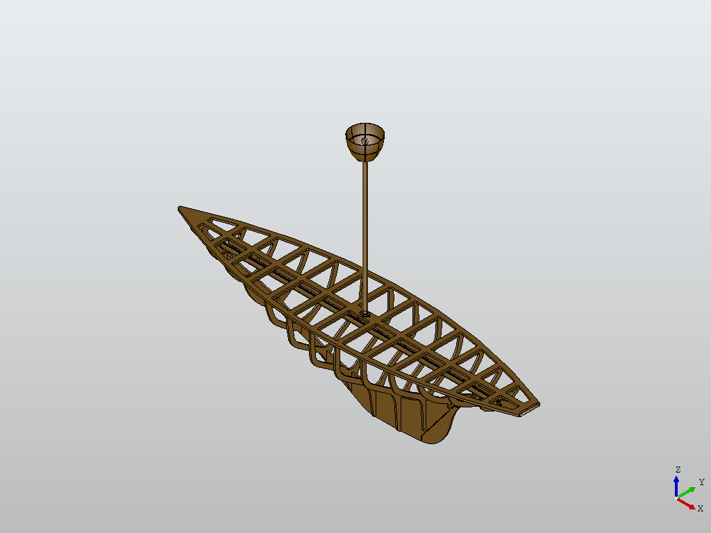
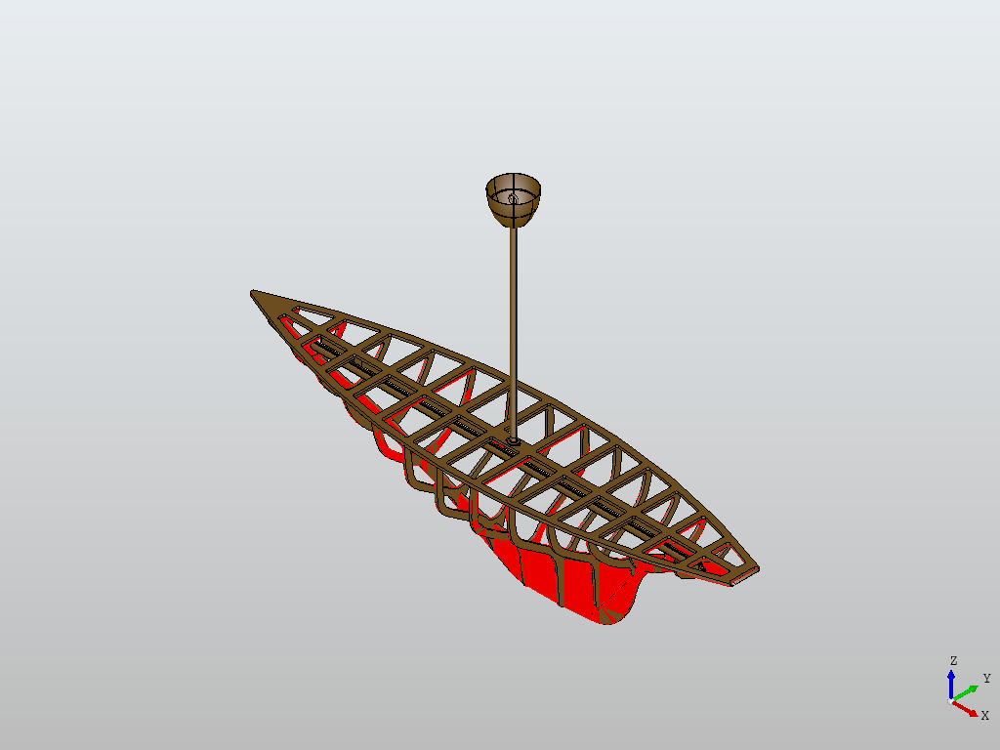
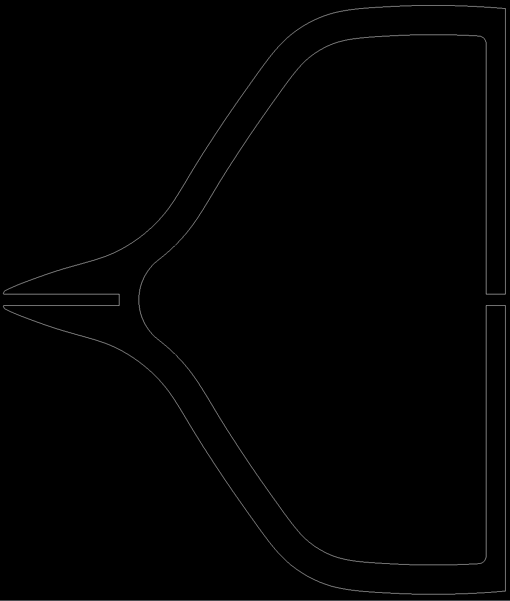

# STEP to DXF plate exporter (GPTv4)

## Introduction
Exporting DXF files from a 3D CAD program can often be a tedious and time-consuming task. This Python program aims to simplify and automate this process. It focuses on extracting specific faces from a 3D model based on certain criteria like thickness and area, then exporting these faces to DXF files. The program utilizes the powerful PythonOCC library to handle 3D geometric data, making it a valuable tool for engineers and CAD professionals.

## Requirements
- Python 3: The program is written in Python and requires Python 3.
- PythonOCC: This is the main library used for handling CAD data. To install PythonOCC, use the Conda package manager:

```bash
conda install -c conda-forge pythonocc-core
```

- ezdxf: A Python package to create and modify DXF drawings, used for exporting data to DXF format. Install it using pip:

```bash
pip install ezdxf
```

## Usage
1. **Setup:** Ensure all required libraries are installed.
2. **Command Line Arguments:**
 - `step_file`: Path to the STEP file. (required)
 - `-t` or `--thickness`: Thickness to find (optional, default is 6).
 ```bash
python main.py sample1.step -t 6
```
3. **Execution:** Run the program with the required arguments. It will identify faces matching your criteria and export them to DXF files.
4. **Results:** Check the output folder for the DXF files and images highlighting the selected faces in the 3D model.


## Example
- **Input:** A 3D CAD model in STEP format.

- **Output:** 
  - DXF files for each identified face contained in output_dxf/.
  - Images displaying the 3D model with and without highlighted faces that meet the specified criteria.

  
  *Input 3D model output_without_highlight.png*

  
  *Output faces highlighted output_without_highlight.png*

    
  *Typical DXF output*

## Current Limitations and Future Work
- File Formats: Currently, the program only supports STEP files. Future versions could include support for other CAD formats.
- Complex Geometry: Handling very complex or large models may result in performance issues.
- User Interface: The program is command-line based. A graphical user interface could be developed for easier interaction.

## Contributions and Feedback
- Contributions to the codebase are welcome. Please refer to the contributing guidelines for more details.
- For feedback or issues, please open an issue on the project's GitHub page.

## Acknowledgment
This software, and README, were prepared almost entirely using serial prompts of GPTv4

[`sample3.step` source](https://grabcad.com/library/310-aptilla-led-lamp-a-1)
